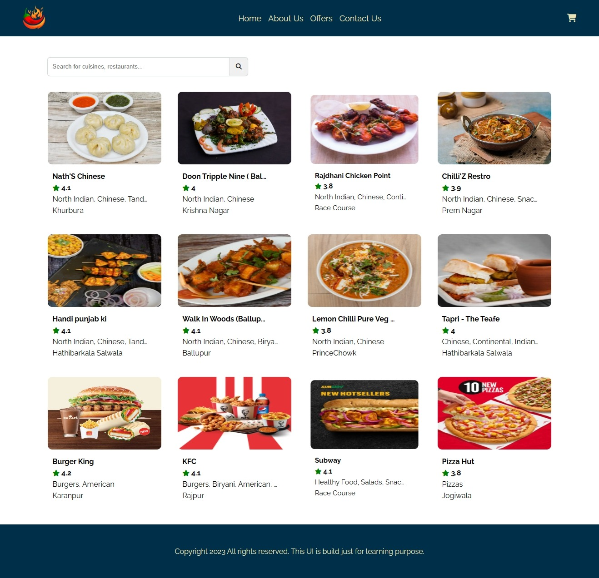

# Namaste React 🚀 Episode 04- Talk is Cheap, Show me the Code

This is the fourth episode of Namaste React 🚀 series by Akshay Saini.

In this episode, we jumped into the coding part. I learned and implemented Functional Components, uses of props, Component Composition and component rendering concepts. using these concepts we build a simple food ordering webpage where we used restaurant lists data from Swiggy and created a card component showing the list of restaurants dynamically in the webpage.

Here is the snapshot of what I build in this episode.
 
