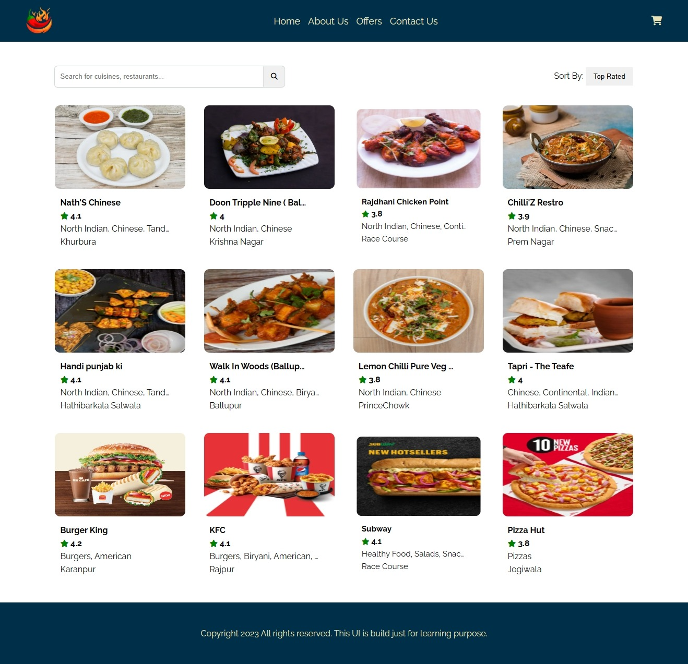

# Namaste React 🚀 Episode 05- Let's Get Hooked

This is the fifth episode of Namaste React 🚀 series by Akshay Saini.

In the previous episode we build a webpage using Swiggy's live api. So in this episode we followed the standard format that industry follows and rearranged our file/folder structure.

Put all of your components in a separate folder inside the `src` folder by creating their respective component files. The component file name must start with the capital letter and the name must match exactly same as the name of the Component.

We learned, there are two types of exports/imports.

<strong>1. Default export/import:</strong> Modules can not default export/import multiple files from a single file.

<ul>
    <li>export default Component;</li>
    <li>import Component from "/path/";</li>
</ul>

<strong>2. Named export/import:</strong> Named export/import is used when we have to export/import multiple elements from a single file.

<ul>
    <li>export const Component</li>
    <li>import {Component} from "/path/";</li>
</ul>

# Hooks
- Hooks are built-in functions in React that allows us to use State or other React features. We use hooks directly inside the function component. 

In this episode we learned about the useState Hook and implement it to create a filter button, which is filtering all the restaurants having average rating greater than 4.0. 

<h4>useState Hook</h4>

- useState() Hook is a very important Hook in React that is used to declare the State of a variable in React. Normally, variables disappear when we exit a function but state variables are preserved in React. 
- The only argument we pass to the useState() hook is the initial state. The argument can be either a number or string only. Unlike classes, State doesn't have to be an object. 
- useState() hook return a pair of values: the current state and the function that updates it.

<code>
// importing the hook
import {useState} from 'react;

// Declaring a state variable
const [var, setVar] = useState();
</code>

Here is the snapshot of what I build in this episode.
 
