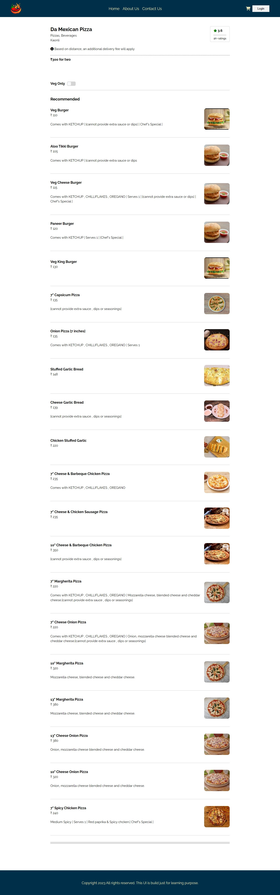

# Namaste React 🚀 Episode 07- Finding The Path

This is the 7th episode of Namaste React 🚀 series by Akshay Saini.

In this episode, we studied about React Router DOM, useEffect() hook and useState() hook in more detail. We learned to create routes and created child routes too.

We create separate page for restaurants where we displayed the restaurant info and menu items listed there. We also created the child routes to navigate to these pages from the home page. The restaurant page looks like this.

