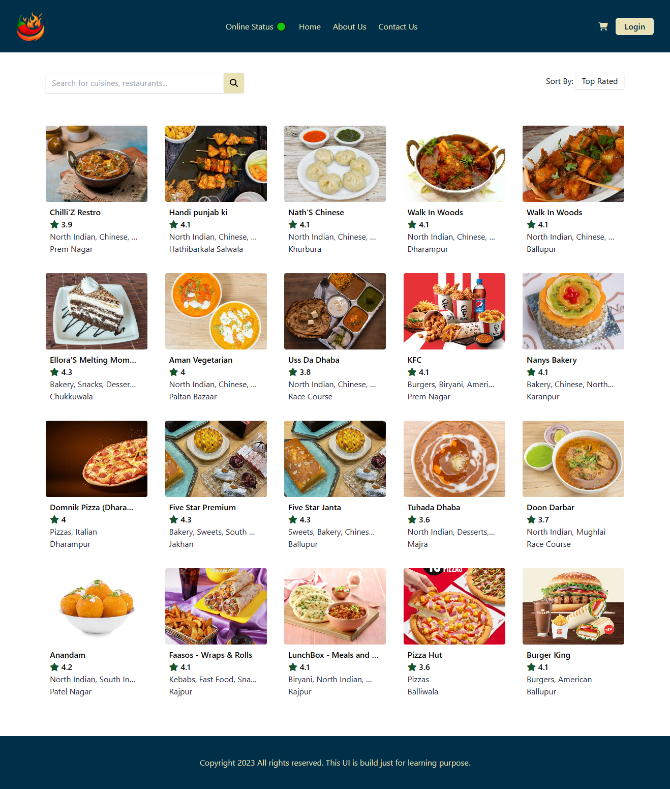
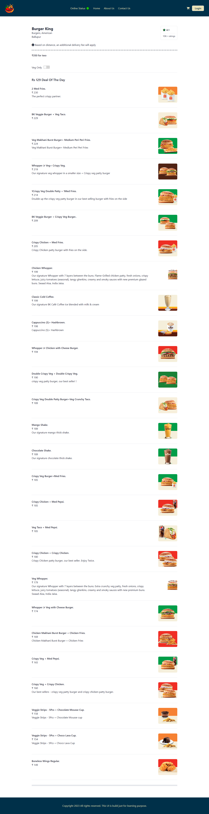

# Namaste React 🚀 Episode 09- Optimising Our App

This is the 10th episode of Namaste React 🚀 series by Akshay Saini.

This episode was all about Tailwind CSS. I learned how to configure and use tailwind css for creating the UI. It is very lightweight UI library and makes the developer work more easy while creating the UI. In this episode, I redesignedd the entire UI using tailwind css.

### Home Page

### Restaurant Page
